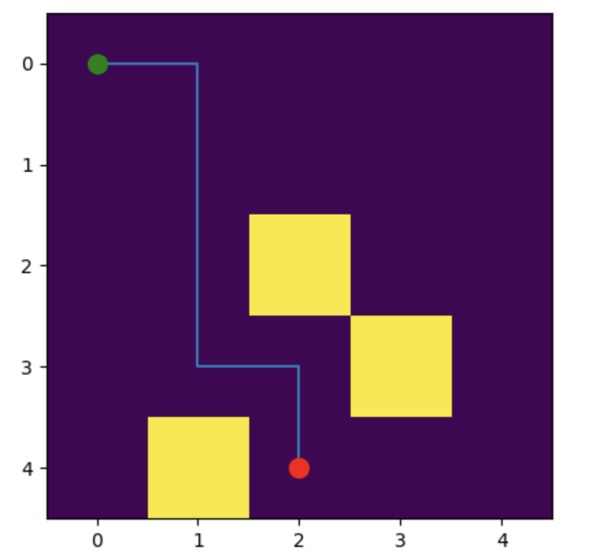

# **GridWorld, 2D Path-Planning Simulator**

A small Python capstone project implementing two classic pathfinding algorithms, Breadth-First Search (BFS) and A\*, on a grid with obstacles. Built as part of a Python-fundamentals learning track, alongside training ACT (Action Chunking with Transformers) imitation-learning policies for robotic manipulation.

Pathfinding algorithms like BFS and A\* are a foundational building block for robot navigation, planning a route through a mapped space before the robot moves.

## **What this project does**

GridWorld is a custom Python class that models a static grid space for a robot to navigate around obstacles, from a start point to a goal. It implements two pathfinding algorithms, BFS and A\*, as methods, along with supporting methods (`get_neighbors`, `reconstruct_path`, `heuristic`, and `plot`) that each handle a specific piece of the search and visualization process. Together, these methods form one coherent structure: the `GridWorld` class.

## **BFS vs A\* What's the difference?**

**BFS** explores the grid in rings: first all cells one step from the start, then all cells two steps away, then three, and so on, in all four directions equally, with no sense of where the goal actually is. It uses a queue with a FIFO (first-in, first-out) rule: the cell discovered first is explored first. Each cell is visited exactly once and never revisited. Because BFS always finishes exploring one entire ring before moving to the next, the first time it reaches the goal is guaranteed to be via the shortest possible path, it finds the goal by exhaustively expanding outward, not by moving toward it.

**A\*** explores using a priority queue instead of a plain queue: instead of popping cells in discovery order, it always pops whichever cell currently has the lowest *estimated total cost* (`f_score`). This estimate combines two things: `g_score`, the actual number of steps taken so far from the start, and a `heuristic`, an estimate of the remaining distance to the goal (calculated here as Manhattan distance, the number of grid steps between two points, ignoring obstacles). Because A\* uses the goal's location to guide its search, it can reach the goal while exploring far fewer cells and quicker than BFS on larger grids, especially when the goal is far from the start.

Unlike BFS, A\* can revisit a cell it has already reached, if a cheaper route to that cell is found later. That's why A\* tracks a `g_score` dictionary rather than a simple `visited` set, it needs to compare "is this new route better than the best one I've already found?" every time, not just "have I been here before?"

For A\* to guarantee the shortest path, its heuristic must be *admissible*, meaning it never overestimates the true remaining distance to the goal. Manhattan distance satisfies this here, since it calculates the exact minimum number of steps possible on a 4-directional grid.

Both algorithms are guaranteed to find the shortest path, and on a small grid like this one, they can find *different* shortest paths of the same length; there's often more than one way to walk the same number of steps. BFS is simpler and needs no extra properties like admissibility to guarantee correctness, which is a reasonable justification for including it here alongside A\*, rather than only implementing the more complex algorithm.

## **Key concepts**

* **Queue vs. priority queue**, a queue (BFS) pops items in the order they were added. A priority queue (A\*) always pops whichever item currently has the lowest priority value (`f_score`), regardless of when it was added.  
* *`visited` set (BFS) vs. `g_score` dict (A)*\*; BFS only needs to know *whether* a cell has been seen before, since the first visit is always the shortest. A\* needs to know the *cost* of the best route found so far to each cell, since a cheaper route can be discovered later.  
* **Heuristic / admissibility**; Manhattan distance estimates the minimum number of steps remaining to the goal. It must never overestimate this true cost, or A\*'s shortest-path guarantee breaks.  
* **`came_from` / path reconstruction**; a dictionary mapping each cell to the cell it was reached from. After the search finds the goal, the path is recovered by walking backward through `came_from` from goal to start, then reversing the result.

## **How to run it**

pip install numpy matplotlib  
python grid\_world.py

This runs a demo on a 5x5 grid with 3 obstacles, printing the grid and plotting the path found by A\* (green \= start, red \= goal).

To use it directly:

from grid\_world import GridWorld  
import numpy as np

grid \= np.zeros((5, 5), dtype=np.uint8)  
grid\[3, 3\] \= 1  
grid\[2, 2\] \= 1  
grid\[4, 1\] \= 1

world \= GridWorld(grid, start=(0, 0), goal=(4, 2))

bfs\_path \= world.reconstruct\_path(world.bfs())  
a\_star\_path \= world.reconstruct\_path(world.a\_star())

world.plot(algorithm="a\_star")  \# or "bfs"

## **Example output**

  

## **Known limitations
Grid bounds are read from self.grid.shape, so the class works for any rectangular grid size, not hardcoded to 5x5.
Only 4-directional movement (up/down/left/right) is supported, no diagonals.
bfs() and a_star() both assume the goal is reachable; if it isn't, they currently return None rather than raising a clear error.
Not optimized for large grids, priority queue can retain stale entries for already-improved cells (a common simplification in basic A* implementations).
